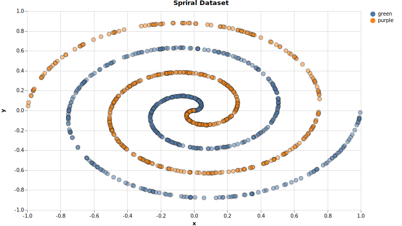
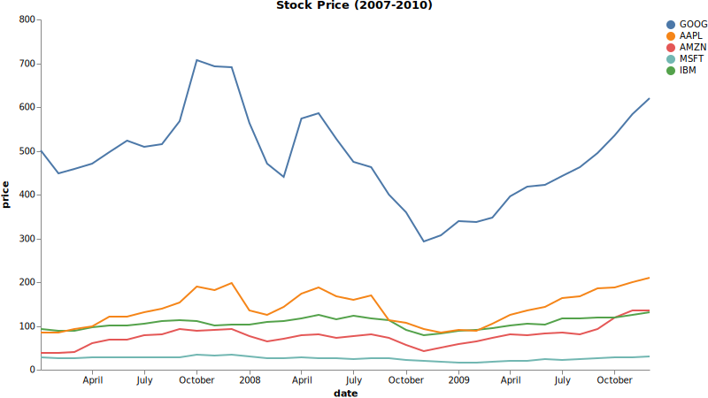

# tech.viz


[](https://clojars.org/techascent/tech.viz)

Simple vega-based visualization of data.




## Usage


Typical expected usage below.  `tech.ml.dataset` is not necessary, it is just used
for processing data in this case.

```clojure
user> (require '[tech.viz.vega :as vega])
nil
user> (require '[tech.ml.dataset :as ds])
nil
user> (require '[tech.v2.datatype.datetime.operations :as dtype-dt-ops])


;;Simple usage
user> (ds/select (ds/->dataset "test/data/spiral-ds.csv") :all (range 5))
test/data/spiral-ds.csv [5 3]:

|     x |      y | label |
|-------+--------+-------|
| 0.041 |  0.075 | green |
| 0.486 |  0.223 | green |
| 0.543 | -0.749 | green |
| 0.154 | -0.376 | green |
| 0.434 | -0.805 | green |
user> (-> (ds/->dataset "test/data/spiral-ds.csv")
          (ds/mapseq-reader)
          (vega/scatterplot "x" "y"
                            {:title "Spriral Dataset"
                             :label-key "label"
                             :background "white"})
          (vega/vega->svg-file "scatterplot.svg"))


;; More involved data processing
user> (ds/select (ds/->dataset "https://vega.github.io/vega/data/stocks.csv")
                 :all (range 5))
https://vega.github.io/vega/data/stocks.csv [5 3]:

| symbol |       date |  price |
|--------+------------+--------|
|   MSFT | 2000-01-01 | 39.810 |
|   MSFT | 2000-02-01 | 36.350 |
|   MSFT | 2000-03-01 | 43.220 |
|   MSFT | 2000-04-01 | 28.370 |
|   MSFT | 2000-05-01 | 25.450 |
user> (as-> (ds/->dataset "https://vega.github.io/vega/data/stocks.csv") ds
      ;;The time series chart expects time in epoch milliseconds
      (ds/add-or-update-column ds "year" (dtype-dt-ops/get-years (ds "date")))
      (ds/filter-column #{2007 2008 2009} "year" ds)
      (ds/update-column ds "date" dtype-dt-ops/get-epoch-milliseconds)
      (ds/mapseq-reader ds)
	  ;;all graphing functions run from pure clojure data.  No batteries required.
      (vega/time-series ds "date" "price"
                        {:title "Stock Price (2007-2010)"
                         :label-key "symbol"
                         :background "white"})
      (vega/vega->svg-file ds "timeseries.svg"))
nil
```



## License

Copyright © 2020 TechAscent, LLC

This program and the accompanying materials are made available under the
terms of the Eclipse Public License 2.0 which is available at
http://www.eclipse.org/legal/epl-2.0.
